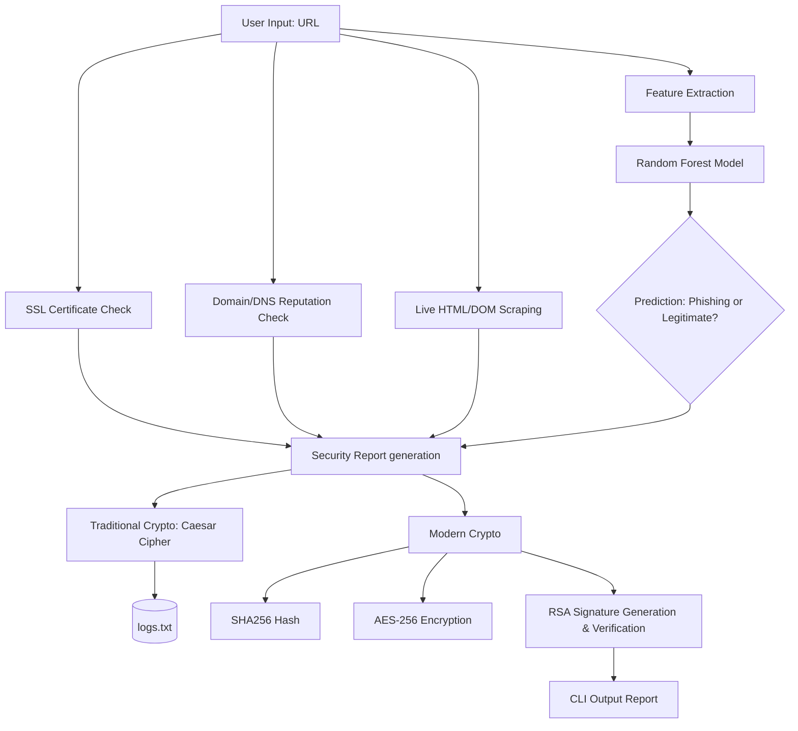

# 🛡️ Phishing Website Detection System


A cybersecurity analysis system that evaluates the trustworthiness and security posture of web URLs by integrating machine learning models, security protocol inspections, active DNS lookups, live HTML analysis, and cryptographic verification techniques to detect potential phishing threats.

---

## 🚀 Features

1. **Machine Learning Detection:** Uses a trained **Random Forest Classifier** to evaluate 8 specific semantic and structural URI features.
2. **Network Protocol Security:** Hooks into `socket` and `ssl` to dynamically fetch and validate X.509 SSL/TLS certificates.
3. **Domain & DNS Analysis:** Live WHOIS domain age lookup, A-record resolution checking, and heuristic checks for suspicious TLDs.
4. **Live HTML/DOM Scraping:** Securely fetches website responses in chunks to parse for hidden IFrames, disabled events, and off-site forms.
5. **Data Integrity & Traceability:** Logs are mathematically obfuscated via **Caesar Cipher** (Traditional Cryptography) or robustly secured using **AES-256-CBC**, **SHA-256** checksums, and **RSA-2048** digital signatures (Modern Cryptography).

---

## 📊 System Architecture



---

## ⚙️ Installation

1. **Clone the repository:**
   ```bash
   git clone https://github.com/yourusername/phishing-website-detection.git
   cd phishing-website-detection
   ```

2. **Install dependencies:**
   Ensure you have Python 3.8+ installed, then run:
   ```bash
   pip install pandas scikit-learn cryptography python-whois dnspython requests beautifulsoup4
   ```

---

## 💻 Usage

Run the analysis engine directly from the terminal by passing a target URL. 

```bash
python3 -m phishing_detector.main "http://testphp.vulnweb.com"
```

### Example Output

```text
[INFO] Starting Phishing Detection System
[INFO] Extracting URL features...
[ML] Loading dataset from dataset.csv...
[ML] Evaluating URL...
[SECURITY] Checking SSL certificate...
[SECURITY] Performing URL reputation check & DNS lookups...
[SECURITY] Scraping and analyzing HTML/DOM securely...
[CRYPTO-TRAD] Encrypting logs using Caesar Cipher...
[CRYPTO-MODERN] Generating SHA256 hash...
[CRYPTO-MODERN] Encrypting results using AES...
[CRYPTO-MODERN] Signing hash with RSA...

========================================
URL: http://testphp.vulnweb.com

ML Prediction: PHISHING
Confidence: 0.99

Security Analysis:
SSL: Not Secure
Domain Reputation: Low Risk
  └ Flags: Missing DNS A records

HTML/DOM Analysis:
Risk Level: Low
Hidden Iframes: No
Right-Click Disabled: No
External Form Targets: No

Cryptographic Logs:
SHA256 Hash: a3fce475ef...3d969da8db
AES Encryption: Successful
Digital Signature: Verified

⚠ WARNING: This website is likely a phishing site.
========================================
```

---

## 📂 Project Structure

```text
.
├── dataset.csv                      # Model training dataset
├── logs.txt                         # Caesar-cipher encrypted historical logs
├── phishing_detector/
│   ├── main.py                      # CLI Application Orchestrator
│   ├── feature_extractor.py         # URL Semantic Analysis
│   ├── ml_model.py                  # Random Forest Classifier
│   ├── ssl_checker.py               # X.509 TLS validation
│   ├── reputation_checker.py        # WHOIS, DNS & Heuristics analyzer
│   ├── html_scraper.py              # BeautifulSoup DOM/HTML analysis
│   ├── traditional_crypto.py        # Caesar Cipher implementations
│   └── modern_crypto.py             # SHA256, AES & RSA implementations
└── README.md
```

---
*Developed for educational purposes in cybersecurity threat hunting and operational cryptography.*